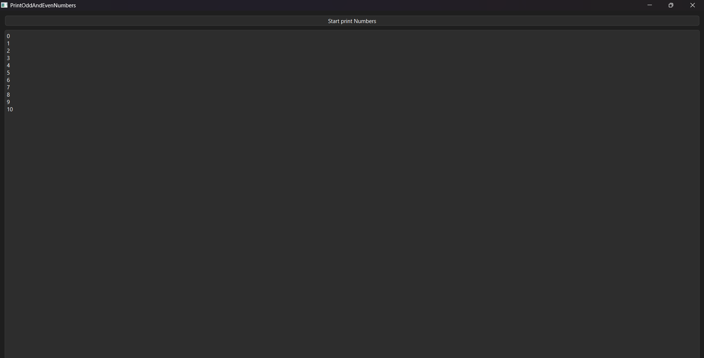

# Qt Multithreading Odd-Even

# Description

This project demonstrates multithreading in Qt C++ using QThread. It prints odd and even numbers using two separate threads with proper synchronization to ensure correct execution order.

# Features

* Uses QThread for multithreading
* Separate threads for odd and even number generation
* Synchronization using mutex and condition variables
* Thread-safe communication using signals and slots
* Demonstrates inter-thread coordination

# 🛠️ Technologies Used

* Qt Framework (C++)
* QThread
* QMutex
* QWaitCondition
* Qt Signals and Slots

# Working Principle

* Two threads are created:

  * One thread handles even numbers
  * Another thread handles odd numbers
* A shared variable controls execution order
* Threads wait and notify each other using condition variables
* Ensures alternate printing (Odd → Even → Odd → Even)

# How to Run

1. Open the project in Qt Creator
2. Build the project
3. Run the application
4. Observe alternating odd and even number output

# Output

# Author

Bharath S
